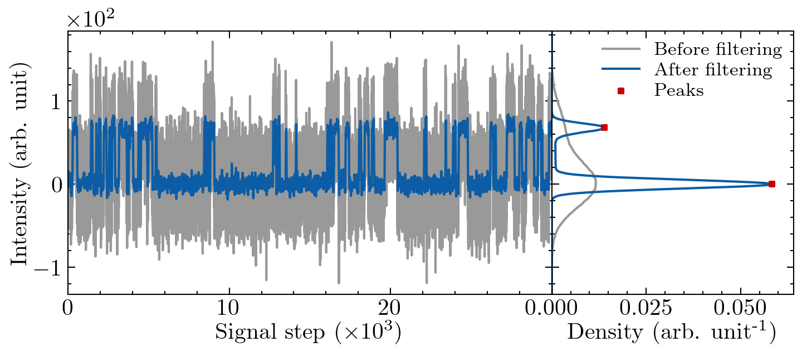
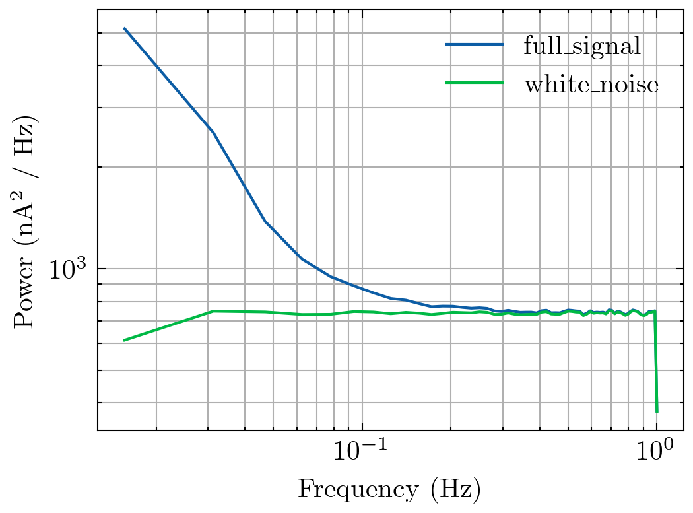
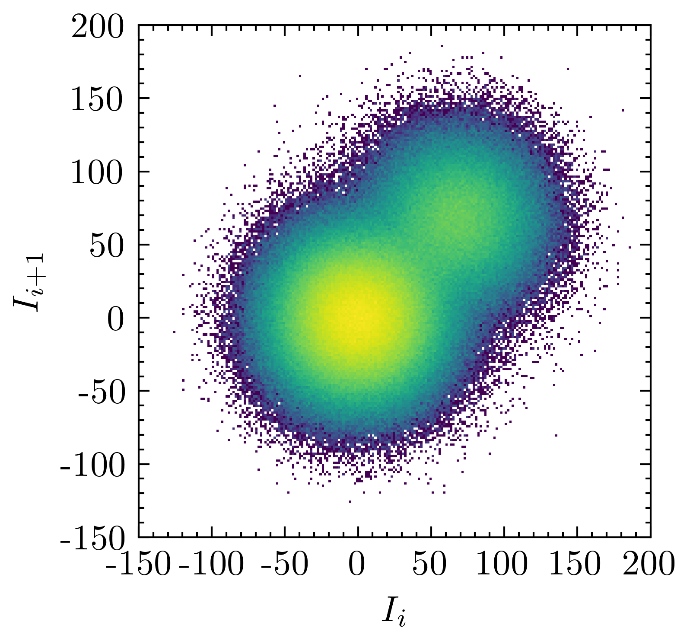
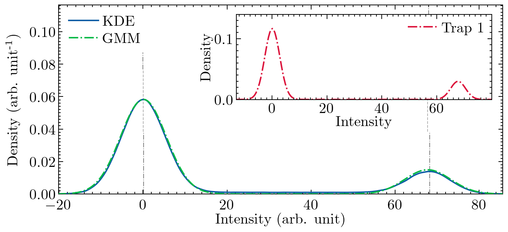

# Usage
```
Usage: python -m main [OPTIONS] COMMAND [ARGS]...

Options:
  --help  Show this message and exit.

Commands:
  aggregate-amplitude-error         Calculate the amplitude error for a set of...
  aggregate-digitization-tau-error  Calculate the digitization and tau error for a set...
  generate-data                     Generate RTN data of different varieties.
  hmm                               Predict the underlying RTN component using HMM for...
  merge-metrics                     Merge many results files (amplitude, digitization,...
  output-time-series                Output time series data using pre-trained models for...
  plot-boxplot-amplitude
  plot-boxplot-artn
  plot-boxplot-digitization
  plot-boxplot-subplots             Plot a boxplot with all metrics using subplots
  plot-boxplot-tau
  plot-cnt-data-prediction          Plot time-series predictions for a specific CNT...
  plot-heatmap-amplitude            Generate the amplitude heatmap reading tau results...
  plot-heatmap-digitization         Generate the digitization heatmap reading tau...
  plot-heatmap-tau                  Generate the Tau heatmap reading tau results from...
  plot-kde                          Make KDE plots for the examples specified by FILES...
  plot-psd
  plot-time-lag                     Make time-lag plots for the examples specified by...
  plot-time-series-predictions      Make time-series-predictions plots for the examples...
  process-gmm                       Run GMM on all examples specified by FILES (specify...
  process-kde                       Run KDE step for the examples specified by FILES...
  replace-pink-noise                Go through the existing examples specified by FILES...
  tau-fitting                       Plot the tau histogram and the e^(-x/tau) / tau...
  train                             Train the RNN model for the examples specified by...
```

## `aggregate-amplitude-error`

Calculate the amplitude error for a set of time-series predictions
specified by FILES (files must end in `_decomp_data_traps.csv`).
Save the resulting dataframe to OUTPUT (supports `.csv`, `.feather`).


```
Usage: python -m main aggregate-amplitude-error [OPTIONS] FILES... OUTPUT

Options:
  --help  Show this message and exit.

```

## `aggregate-digitization-tau-error`

Calculate the digitization and tau error for a set of time-series
predictions specified by FILES (files must end in
`_time_series_predictions.feather`). Save the resulting dataframe to OUTPUT
(supports `.csv`, `.feather`).
The reason to combine these two like this is that they are both calculated
from the time-series predictions of the digitization step
and to facilitate some housekeeping.


```
Usage: python -m main aggregate-digitization-tau-error [OPTIONS] FILES... OUTPUT

Options:
  -f, --filter INTEGER  Size of the filter to use on the digitized raw output. This step used to be done in
                        the RNN code, but it's better to do it here. We used to use 18. Use `0` to disable.
  --help                Show this message and exit.

```

## `generate-data`

Generate RTN data of different varieties.


```
Usage: python -m main generate-data [OPTIONS]

Options:
  --examples INTEGER              Number of examples to generate.  [required]
  --signal-length INTEGER         Length of signal to generate  [required]
  --noise TEXT                    Level of white noise to add to the signal. Can either be the absolute value,
                                  or the low and high value (separated by `-`) to generate randomly.
                                  [required]
  --variety [metastable|missing-level|coupled|normal]
                                  [required]
  --traps INTEGER                 The number of traps  [required]
  --out-dir PATH                  Where to save the data  [required]
  --help                          Show this message and exit.

```

## `hmm`

Predict the underlying RTN component using HMM
for all signals specified by FILES (provide `_signals.feather` files).
Write the time-series predictions to RESULTS_DIR.
This uses HMM, not fHMM, so it only really works for 1-trap data.


```
Usage: python -m main hmm [OPTIONS] FILES... RESULTS_DIR

Options:
  --help  Show this message and exit.

```

## `merge-metrics`

Merge many results files (amplitude, digitization, tau) into a single one.
Specify results files by FILES and write the result to OUTPUT-FILE.
FILES should be `.csv` or `.feather` encoded pandas dataframes.
Files will be merged on the intersection of their columns.
Usually, these columns are `n_traps`, `noise`, `example`, `trap`,
`artn_type`, `zone`.


```
Usage: python -m main merge-metrics [OPTIONS] [FILES]... OUTPUT_FILE

Options:
  --help  Show this message and exit.

```

## `output-time-series`

Output time series data using pre-trained models
for the examples specified by FILES (specify `_signals.feather` files).
Save the results in RESULTS_DIR.


```
Usage: python -m main output-time-series [OPTIONS] FILES... RESULTS_DIR

Options:
  -m, --mode [normal|metastable|coupled|missing-level|auto]
                                  Algorithm mode. If `auto`, detect automatically from filename.  [required]
  -n, --n-traps [1|2|3|auto]      The number of traps. If `auto`, determine from filename.  [required]
  -l, --recurrent-layer [gru|lstm]
                                  Type of recurrent layer to use (RNN only)  [required]
  --model-type [rnn|wavenet]      Model structure to use  [required]
  --help                          Show this message and exit.

```

## `plot-boxplot-amplitude`


```
Usage: python -m main plot-boxplot-amplitude [OPTIONS]

Options:
  --help  Show this message and exit.

```

## `plot-boxplot-artn`


```
Usage: python -m main plot-boxplot-artn [OPTIONS] FILES... OUTPUT_FILE

Options:
  --help  Show this message and exit.

```

## `plot-boxplot-digitization`


```
Usage: python -m main plot-boxplot-digitization [OPTIONS]

Options:
  --help  Show this message and exit.

```

## `plot-boxplot-subplots`

Plot a boxplot with all metrics using subplots


```
Usage: python -m main plot-boxplot-subplots [OPTIONS] FILES... OUTPUT_FILE

Options:
  --sort / --no-short  Whether to separate and sort the traps into classes (a, b, c).
  --help               Show this message and exit.

```

## `plot-boxplot-tau`


```
Usage: python -m main plot-boxplot-tau [OPTIONS]

Options:
  --help  Show this message and exit.

```

## `plot-cnt-data-prediction`

Plot time-series predictions for a specific CNT result
specified by FILES (specify `_signals.feather` files).


```
Usage: python -m main plot-cnt-data-prediction [OPTIONS] FILES...

Options:
  --inset / --no-inset  [required]
  --tlp / --no-tlp      Whether to add a time-lag plot  [required]
  --help                Show this message and exit.

```

## `plot-heatmap-amplitude`

Generate the amplitude heatmap reading tau results from FILES
(pandas dataframes, supports `.csv` or `.feather`) and save the figures to
OUTPUT-DIR.


```
Usage: python -m main plot-heatmap-amplitude [OPTIONS] FILES... OUTPUT_DIR

Options:
  --output-format [pdf|png]
  --help                     Show this message and exit.

```

## `plot-heatmap-digitization`

Generate the digitization heatmap reading tau results from FILES
(pandas dataframes, supports `.csv` or `.feather`) and save the figures to
OUTPUT-DIR.


```
Usage: python -m main plot-heatmap-digitization [OPTIONS] FILES... OUTPUT_DIR

Options:
  --sorted / --unsorted      Whether to sort the rows
  --output-format [pdf|png]
  --subtract TEXT
  --name-suffix TEXT
  --help                     Show this message and exit.

```

## `plot-heatmap-tau`

Generate the Tau heatmap reading tau results from FILES (pandas dataframes,
supports `.csv` or `.feather`) and save the figures to OUTPUT-DIR.


```
Usage: python -m main plot-heatmap-tau [OPTIONS] FILES... OUTPUT_DIR

Options:
  --help  Show this message and exit.

```

## `plot-kde`

Make KDE plots for the examples specified by FILES (specify
`_signals.feather` files).


```
Usage: python -m main plot-kde [OPTIONS] FILES...

Options:
  --mode [normal|metastable|coupled|missing-level|auto]
                                  The algorithm mode. If `auto`, determine from filename.  [required]
  --debug / --no-debug            Add debug information to the figure, like N_peaks
  --output-format [pdf|png]
  --help                          Show this message and exit.

```

### Example 1: 
To generate the KDE plot, run the command:

`python -m main plot-kde "~/OneDrive/02. QuIN_Research/31. Noise-RTN/01. 2021_Algorithm paper/simulated_rtn/2021_07_23_generated_normal_rtn_data_4_white_noise_study/1-trap_wn=0.4_example=0_signals.feather" --output-format=png`


## `plot-psd`


```
Usage: python -m main plot-psd [OPTIONS] FILES...

Options:
  --output-format [pdf|png]
  --help                     Show this message and exit.

```

### Example 1: 
Plot the power spectral density of an example using Welch's method

`python -m main plot-psd "~/OneDrive/02. QuIN_Research/31. Noise-RTN/01. 2021_Algorithm paper/simulated_rtn/2021_07_23_generated_normal_rtn_data_4_white_noise_study/1-trap_wn=0.4_example=0_signals.feather" --output-format=png`


## `plot-time-lag`

Make time-lag plots for the examples specified by FILES (specify
`_signals.feather` files).


```
Usage: python -m main plot-time-lag [OPTIONS] FILES...

Options:
  --bins INTEGER
  --output-format [pdf|png]
  --author TEXT              Add your name and the date to the figure.
  --help                     Show this message and exit.

```

### Example 1: 
Plot the time-lag plot for an example

`python -m main plot-time-lag "~/OneDrive/02. QuIN_Research/31. Noise-RTN/01. 2021_Algorithm paper/simulated_rtn/2021_07_23_generated_normal_rtn_data_4_white_noise_study/1-trap_wn=0.4_example=0_signals.feather" --output-format=png`


## `plot-time-series-predictions`

Make time-series-predictions plots for the examples specified by FILES
(specify `_signals.feather` files).


```
Usage: python -m main plot-time-series-predictions [OPTIONS] FILES...

Options:
  --output-format [pdf|png]
  --help                     Show this message and exit.

```

## `process-gmm`

Run GMM on all examples specified by FILES (specify `_signals.feather`
files).


```
Usage: python -m main process-gmm [OPTIONS] FILES...

Options:
  -m, --mode [normal|metastable|coupled|missing-level|auto]
                                  Algorithm mode. If `auto`, detect automatically from filename.  [required]
  --output-format [pdf|png]
  --help                          Show this message and exit.

```

### Example 1: 
To process the GMM and generate the GMM plot, run the command:

`python -m main process-gmm "~/OneDrive/02. QuIN_Research/31. Noise-RTN/01. 2021_Algorithm paper/simulated_rtn/2021_07_23_generated_normal_rtn_data_4_white_noise_study/1-trap_wn=0.4_example=0_signals.feather" --output-format=png`


## `process-kde`

Run KDE step for the examples specified by FILES
(specify `_signals.feather` or `_signals.csv` files).


```
Usage: python -m main process-kde [OPTIONS] FILES...

Options:
  --mode [normal|metastable|coupled|missing-level|auto]
                                  The algorithm mode. If `auto`, determine from filename.  [required]
  --input-column TEXT             The column of the input dataframe to consider as the raw, noisy input
                                  signal.
  --help                          Show this message and exit.

```

### Example 1: Process single file
To run the KDE step on a file, execute this command (the path depends on where you saved the data on your computer).

`python -m main process-kde "~/OneDrive/02. QuIN_Research/31. Noise-RTN/01. 2021_Algorithm paper/simulated_rtn/2021_07_23_generated_normal_rtn_data_4_white_noise_study/1-trap_wn=0.0_example=0_signals.feather"`


### Example 2: Process multiple files

You can also process multiple examples in parallel by specifying a pattern
rather than a single file. The example below uses the wildcard character `*`
to match any file in the white noise study folder ending in
`_signals.feather`.


`python -m main process-kde "~/OneDrive/02. QuIN_Research/31. Noise-RTN/01. 2021_Algorithm paper/simulated_rtn/2021_07_23_generated_normal_rtn_data_4_white_noise_study/*_signals.feather"`


## `replace-pink-noise`

Go through the existing examples specified by FILES and replace the white
noise with 1/f pink noise. Don't overwrite those, but rather save the
dataframe with the replaced pink noise in wa new location


```
Usage: python -m main replace-pink-noise [OPTIONS] FILES... RESULTS_DIR

Options:
  --help  Show this message and exit.

```

## `tau-fitting`

Plot the tau histogram and the e^(-x/tau) / tau fitting
for all examples specified by FILES.


```
Usage: python -m main tau-fitting [OPTIONS] FILES...

Options:
  --help  Show this message and exit.

```

## `train`

Train the RNN model for the examples specified by FILES (specify
`_signals.feather` files).
Save the results (trained model, full predictions, accuracies) in
RESULTS_DIR.

For now, this command is only recommended for normal RTN.
Please use `train-artn` or `train-cnt` for other types.
I am working on resolving this.


```
Usage: python -m main train [OPTIONS] FILES... RESULTS_DIR

Options:
  -m, --mode [normal|metastable|coupled|missing-level|auto]
                                  Algorithm mode. If `auto`, detect automatically from filename.  [required]
  --retrain / --no-retrain        Wether to retrain or to load weights from the saved .h5 file  [required]
  -n, --n-traps [1|2|3|auto]      The number of traps. If `auto`, determine from filename.  [required]
  -l, --recurrent-layer [gru|lstm]
                                  Type of recurrent layer to use (RNN only)  [required]
  --model-type [rnn|wavenet]      Model structure to use  [required]
  --help                          Show this message and exit.

```

### Example 1: 
The RNN is run in a similar way, although there are many more options (like GRU vs. LSTM).

`python -m main train "~/OneDrive/02. QuIN_Research/31. Noise-RTN/01. 2021_Algorithm paper/simulated_rtn/2021_07_23_generated_normal_rtn_data_4_white_noise_study/1-trap_wn=0.4_example=0_signals.feather"`

