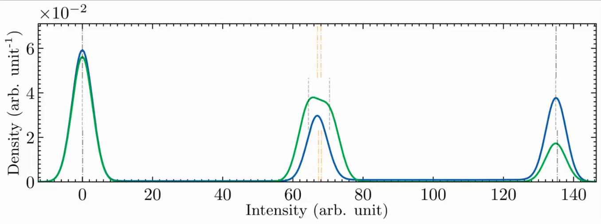

# Algorithm Modes

The algorithm has five different modes of operation:

1. Normal RTN
1. Metastable aRTN
1. Missing-level aRTN
1. Coupled aRTN
1. Real CNT data

These are defined as an enum in [`mode.py`](../mode.py).

At certain phases of the algorithm, steps are added or modified depending on this running mode in order to get a better result for that particular type of RTN.

Currently, this mode is specified manually. There are plans to detect it automatically, but that is not working perfectly yet.

## 1. KDE

There are no differences between the modes for this step.

## 2. GMM

This step must treat missing-level and coupled aRTN differently.
Metastable aRTN is not affected because it is indistinguishable from normal RTN in the probability-density-function domain.

### Missing-level aRTN

* A **seed value is added** to the list of RTN levels used to construct the mixture model. Normally, if 3 peaks are detected, we assume there was a masked peak and run the algorithm assuming each peak is doubled. However, for missing-level aRTN, we should instead [use the levels we know to calculate the approximate position of the missing level](../main_algorithm/b_gmm/process_decomposition.py#L72).
* **The area under the missing peak is forced to be zero.** Normally, there is a system of equations to calculate the area of each peak. These represent probabilities, so they should sum to one. Therefore, when one level is missing, the algorithm has problems and tries to boost the area of the peak that is there by offsetting the guess peaks to either side of the true peak. We remedy this by [forcing the area of one peak to be zero](../main_algorithm/b_gmm/define_mixture_model.py#L63). Please see the picture below or review the meeting of 2022/01/21 for more information.

	|  |
	|:--:|
	| *An example of the problem that occurs for a missing level signal where one peak is not force to be zero and the two traps have very similar amplitudes.* |
* **Allow peak area to be zero.** When there are masked peaks, we run the GMM for every combination of double peaks and take the best result. Usually, when the area of one peak is zero, we can be very confident that this combination was not correct and did not fit well. However, for missing level, we expect one peak to be zero, so we must [remove this check](../main_algorithm/b_gmm/process_decomposition.py#L146).

### Coupled aRTN

* An **extra fitting parameter** is added called the **coupling factor**. This represents the difference between the true value and the expected value of the highest intensity peak.By expected value, I mean its location according to the sum of other peaks. This parameter is optimized during learning, but giving it an initial value according to this calculation on the KDE peaks greatly improves the result.
	- The parameter is defined and the initial value calculated [here](../main_algorithm/b_gmm/process_decomposition.py#L142).
	- The coupling factor is added to the mixture model [here](../main_algorithm/b_gmm/define_mixture_model.py#L56).

* The code to detect that a **trap was missed** is **ignored**. This code checks how much the difference between the peaks deviates from the expected value. If the deviation is large, an extra peak is added. This code catches 6 3-trap examples that were previously misclassified as 2-trap. However, the main feature of coupled aRTN is that the highest peak is not exactly where we expect, so we must disable this.

## 3. RNN

- The mode is used to generate **tailored training data**. For example, for metastable examples, we train the network on synthetic metastable data for a better result.

### Metastable aRTN

- For metastable aRTN, we must **predict the zone** in order to define $`\tau`$ error.
