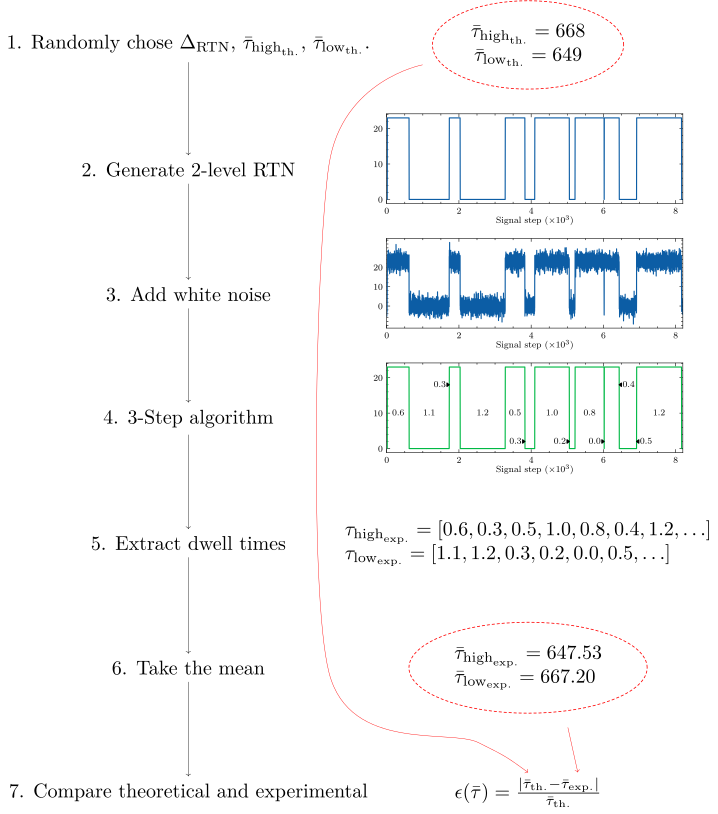
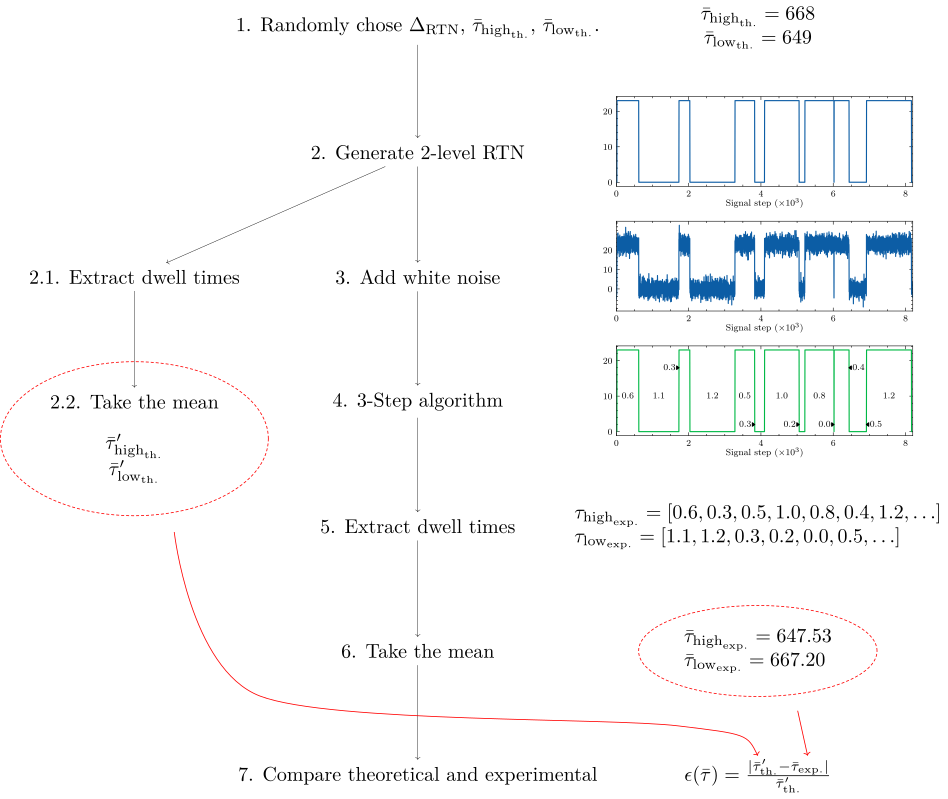

# $`\tau`$ error definition

The definition of $`\tau`$ error has been changed to be more fair to our algorithm.
Previously, the theoretical value for $`\tau`$ was chosen randomly from a uniform distribution.
Although in theory this should perfectly correspond to the mean of an infinite list of dwell times chosen from a geometric distribution with this parameter, in practise, our signal is finite.
Therefore, we would often observe very high τ error, even if the digitization accuracy were perfect.

|  |
|:--:|
| *The original method compares directly to the theoretical value to calculate the τ error* |

The new methods uses a new theoretical value. Let's call it $`\tau_\mathrm{th.}^\prime`$, to distinguish it. This new value is calculated from the generated pure 2-level signal in exactly the same way that $`\tau_\mathrm{exp.}`$ is calculated from the output of the RNN.
The dwell times are extracted from the digital signal, and the mean is taken.

|  |
|:--:|
| *The new method compares to the list of simulated dwell times to calculate the τ error* |
